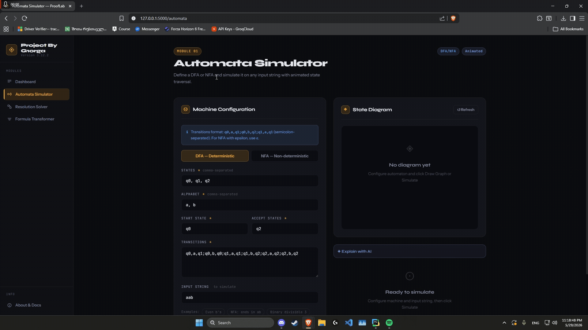
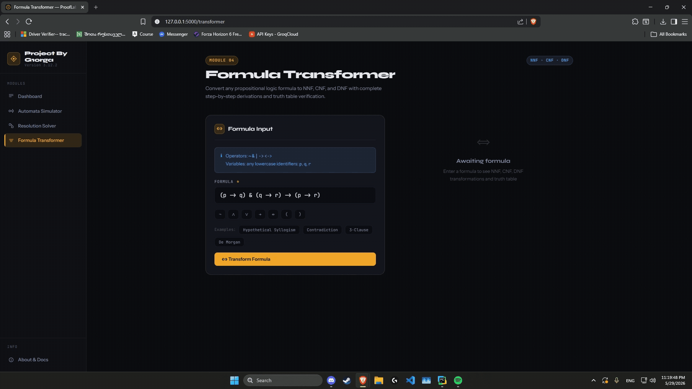

# 🔷 ProofLab — TFCS Platform `v3.13.0`
### *Theoretical Foundations of Computer Science · Platform by G1orga*

> **A full-stack interactive formal methods toolkit** built with Python (Flask) backend and a modern dark-themed frontend. All computational logic runs server-side in Python; JavaScript handles only UI rendering and asynchronous requests.

---

## 📌 Project Overview

ProofLab is a web application implementing formal computer science modules in one cohesive interface:

| # | Module | Description |
|---|--------|-------------|
| 01 | **Automata Simulator** | DFA/NFA simulation with step-by-step trace and Cytoscape.js state diagram |
| 02 | **Pushdown Automaton** | PDA simulation via BFS over configurations, acceptance by final state or empty stack |
| 03 | **Resolution Solver** | Propositional resolution with CNF conversion and full proof visualisation |
| 04 | **Formula Transformer** | NNF, CNF, DNF transformations with step annotations and truth table generation |

Every module includes an **AI Explainer** — a streaming, markdown-rendered breakdown of the computation powered by Groq (LLaMA 3.3 70B).

---

## 📸 Screenshots

### 🏠 Welcome Page


### ⚙️ Automata Simulator — DFA / NFA


### 🔁 Formula Transformer — NNF / CNF / DNF


### 🧩 Resolution Solver


---

## 🏗️ Architecture

```
prooflab/
├── app.py                    # Flask application + all REST API routes
├── requirements.txt          # Python dependencies
├── .env                      # Environment variables (not committed)
├── README.md
│
├── algorithms/               # Pure Python computation — no Flask dependency
│   ├── automata.py           # DFA/NFA: transitions, ε-closure, acceptance
│   ├── pda.py                # PDA: BFS simulation, stack management
│   ├── resolution.py         # Parser, AST transforms, clause resolution
│   ├── transformer.py        # NNF/CNF/DNF transforms, truth table
│   └── ai_explainer.py       # Groq streaming prompt builder
│
├── templates/                # Jinja2 HTML (all extend base.html)
│   ├── base.html             # Sidebar nav, toast system, shared layout
│   ├── welcome.html          # Landing / presentation page
│   ├── index.html            # Platform dashboard
│   ├── automata.html         # DFA/NFA/PDA simulator page
│   ├── resolution.html       # Resolution solver page
│   ├── transformer.html      # Formula transformer page
│   └── about.html            # Documentation & API reference
│
└── static/
    ├── css/
    │   ├── main.css          # Full design system (CSS variables, components)
    │   └── welcome.css       # Landing page styles
    └── js/
        ├── main.js           # Sidebar, toasts, API calls, tabs, graph rendering
        ├── welcome.js        # Landing page animations
        └── ai-explain.js     # SSE streaming handler
```

**Backend → Frontend flow:**
1. User fills form → JS collects data → `fetch()` POST to Flask endpoint
2. Flask calls Python algorithm module → returns JSON
3. JS renders result HTML inline (steps, formulas, graphs, proof trees)

---

## ⚙️ Technologies

| Layer | Technology | Purpose |
|-------|------------|---------|
| Backend | Python 3.13+ | All algorithms and computation |
| Framework | Flask 3.1.3 | HTTP server, routing, JSON API |
| Templating | Jinja2 3.1.6 | HTML template inheritance |
| AI | Groq · LLaMA 3.3 70B | Streaming educational explanations |
| Graph Viz | Cytoscape.js 3.28 | Automata state diagrams |
| Frontend | Vanilla JS | fetch API, DOM rendering, UI |
| Styling | CSS Custom Properties | Full design system, responsive |
| Fonts | Syne + JetBrains Mono | Display + monospace typography |

---

## 🚀 Getting Started

### Prerequisites

- Python **3.13+**
- A free [Groq API key](https://console.groq.com)

### Installation

```bash
# 1. Clone the repository
git clone https://github.com/your-username/prooflab.git
cd prooflab

# 2. Create and activate a virtual environment
python -m venv venv
source venv/bin/activate        # Linux / macOS
venv\Scripts\activate           # Windows

# 3. Install dependencies
pip install -r requirements.txt
```

### Environment Variables

Create a `.env` file in the project root:

```env
GROQ_API_KEY=your_groq_api_key_here
```

> ⚠️ Never commit your `.env` file. Make sure it is listed in `.gitignore`.

### Run

```bash
python app.py
```

Open **http://localhost:5000** in your browser.

---

## 🔌 API Reference

All computation is handled server-side. The frontend communicates via these JSON endpoints:

| Method | Endpoint | Description |
|--------|----------|-------------|
| `POST` | `/api/automata/simulate` | Simulate a DFA or NFA on an input string |
| `POST` | `/api/automata/graph` | Get graph node/edge data for Cytoscape.js |
| `POST` | `/api/pda/simulate` | Simulate a PDA on an input string (BFS) |
| `POST` | `/api/pda/graph` | Get PDA graph data |
| `POST` | `/api/resolution/solve` | Apply the resolution method to a formula |
| `POST` | `/api/transformer/transform` | Transform a formula to NNF, CNF, and DNF |
| `POST` | `/api/explain/<module>` | Stream an AI explanation (Server-Sent Events) |

---

## 🧮 Input Syntax

### Propositional Logic

| Symbol | Operator | Example |
|--------|----------|---------|
| `~` | Negation (¬) | `~p` |
| `&` | Conjunction (∧) | `p & q` |
| `\|` | Disjunction (∨) | `p \| q` |
| `->` | Implication (→) | `p -> q` |
| `<->` | Biconditional (↔) | `p <-> q` |

Parentheses are fully supported: `(p | q) & (~p | r) & (~q | ~r)`

### Finite Automaton Transitions

One transition per line, format: `from_state, symbol, to_state`

```
q0, a, q1
q0, b, q0
q1, a, q2
```

### PDA Transitions

Format: `state, input_symbol, stack_top, next_state, push_string`

```
q0, a, Z, q1, AZ
q1, a, A, q1, AA
q1, b, A, q2, ε
q2, b, A, q2, ε
q2, ε, Z, q3, Z
```

Use `ε` for epsilon (no input consumed / no stack push).

---

## 🧠 Algorithm Details

### Finite Automata Simulation
- **DFA:** Deterministic transition function δ: Q × Σ → Q. At each step, exactly one next state. Dead state on missing transition.
- **NFA:** ε-closure via BFS over epsilon transitions. Each symbol maps the current state *set* to a new set. Accepts if the intersection with F ≠ ∅.

### Pushdown Automaton Simulation
BFS over configurations `(state, remaining_input, stack)`. Supports non-determinism by exploring all successor configurations. Acceptance by final state or by empty stack (configurable). Search is bounded to prevent infinite loops on ambiguous grammars.

### Resolution Method
1. Parse formula → AST (recursive descent parser)
2. Eliminate biconditionals: `P ↔ Q ≡ (P → Q) ∧ (Q → P)`
3. Eliminate implications: `P → Q ≡ ¬P ∨ Q`
4. Push negations inward via De Morgan's laws → NNF
5. Distribute ∨ over ∧ → CNF
6. Extract clause set
7. Pick pairs of clauses with complementary literals, derive resolvents
8. Empty clause derivable → **UNSATISFIABLE**; saturation without empty clause → **SATISFIABLE**

### NNF / CNF / DNF Transformation
- **NNF:** Remove implications and biconditionals, push negations to literals
- **CNF:** NNF + recursively distribute ∨ over ∧ — `P ∨ (Q ∧ R) ≡ (P ∨ Q) ∧ (P ∨ R)`
- **DNF:** NNF + recursively distribute ∧ over ∨ — `P ∧ (Q ∨ R) ≡ (P ∧ Q) ∨ (P ∧ R)`

---

## 🤖 AI Explainer

Each module features a streaming AI explanation of the computation result:

- **Provider:** [Groq](https://groq.com) — free tier
- **Model:** `llama-3.3-70b-versatile`
- **Delivery:** Server-Sent Events (SSE), rendered progressively with markdown
- **Context-aware:** The explainer receives the actual computation data (formula, steps, clauses, states) and references them directly — never generic output

---

## 🗺️ Demo Walkthrough

| Route | What to try |
|-------|-------------|
| `/` | Landing page — project overview and module showcase |
| `/index` | Platform dashboard — module cards and quick-start links |
| `/automata` | Load the "Binary divisible by 3" DFA example → Simulate → observe graph + step trace |
| `/automata` (PDA tab) | Enter `aabb` on a balanced-string PDA → observe BFS stack trace |
| `/resolution` | Enter `(p -> q) & (~q) & p` → proves **UNSATISFIABLE** via empty clause derivation |
| `/transformer` | Enter `p \| ~p` → identified as **Tautology**, all three normal forms shown |
| `/about` | Full documentation, API reference, and installation guide |

---

## 📦 Dependencies

| Package | Version |
|---------|---------|
| Flask | 3.1.3 |
| Jinja2 | 3.1.6 |
| Werkzeug | 3.1.8 |
| click | 8.4.1 |
| colorama | 0.4.6 |
| itsdangerous | 2.2.0 |
| MarkupSafe | 3.0.3 |
| groq | latest |

---

## 🗺️ Roadmap

- [ ] Turing Machine Simulator
- [ ] CYK Parser
- [ ] Regular Expression Engine
- [ ] Context-Free Grammar tools
- [ ] Unification Algorithm

---

## 📄 License

This project is open for educational use. Feel free to fork and build on it.

---

<div align="center">
  <sub>Built by <strong>G1orga</strong> · ProofLab v3.13.0</sub>
</div>
